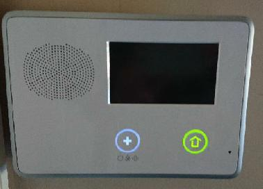

Please understand that this was my first project using:

* Raspberry Pi,                  
* Software Defined Radio, 
* Linux,
* C programming,
* OpenHAB,
* mqtt,
* mosquitto,
* z-wave (for other sensors),
* github.

So I am sure many things could have been done better.

### Background:

During the summer of 2018 I purchased a home that had a security system. This is the alarm panel:

During the move in I called the alarm company to transfer the service to my name.  I was told the cost would be $50.00 per month BUT my alarm panel was obsolete and I needed a new one at a cost of $650 including tax.   I decided to wait.  Interestingly the cable guy was installing cable at the time and he said it was ridiculous.  He had the same panel in his house and he knew they were still doing installs using that panel.

A month or so later I called the company again and was told the service would cost $50.00 per month (no mention of new panel and I didn't ask).  But I would have to pay a $100.00 transfer fee.  I said, "Wait a minute, you want me to pay you $100 for the privilege of you charging me $50 per month?  You should be giving me a few months for free".  That ended that.

About 6 months later I ran across dengland's amazing project:

[Decode 345](https://github.com/denglend/decode345)

That convinced me that I could duplicate the functions performed by the commercial  system.

Eleven months later I had succeeded. I now can have a text message and email sent whenever any door or window is opened.  I also get the messages if any smoke detector, CO detector, or glass break sensor triggers.  The commercial system would also call the local police under certain conditions.  I am looking into that addition.

