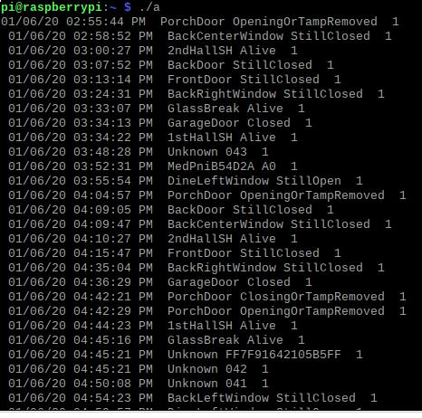

I use four items for the matching process.  First is the terminal screen that is displaying in real time what the program 345MHz is seeing.  The second is Code2Devices.xls and the third and fourth are 345MHzRamA.log and 345MHzRamB.log.

The terminal screen was described in Overview of Matching WORDs To Events.  If you have your door sensor and magnet you can move the magnet against the sensor and get the WORD that it sends when the door is closing.  Move the magnet away and get the door is opening WORD.  It would not be unusual to have some other sensor in your house pop up and transmit in the middle of this so don't let it confuse you.

345MHzRamA.log and 345MHzRamB.log are a pair of "flip/flop" buffers.  They are in /dev/shm/ so I hope that means they are in RAM not on the SD card. The first one will dump to the screen using ./a and the second, ./b.

 Each is up to 500 events long. Each time 345MHz receives a WORD I write either the Device and Action or the Unknown to the log along with a time stamp.  When I get to 500 events I flip to the other of the pair.  When that one gets to 500 events I erase the older one and start logging events there.  Here is a typical capture of one of them.

 

## Code2Device.xls description
The real work of matching gets done with Code2Device.xls.  I tend to use this with Excel on my Windows desktop.  I tried it a few times with LibreOffice Calc and it seemed to work fine.  The purpose of Code2Device.xls is to provide a lookup table to convert WORDs to a Device and Action or event.

I guess it is best if you open it up and see the dirty laundry.  For now just stick to the first worksheet (SensorDescription) and with the first 25 rows or so.

Column A, **Hex Code** is the WORD received that we are trying to match to a device and event.

Column B, **Device** picks out nibbles 5 through 10 of the WORD since it seems to identify the sensor that transmitted the WORD (well, in most cases discussed later). 

Column C, **Event** is the event from nibbles 11 and 12 that is being reported.  If you look at rows 19 and 20 you can see that the Back Door sensor is reporting the Closing event and the Opening event respectively. 

Column D is **My Notes** where I keep track of what I am concluding as I build the file.  Anything can be typed here.

Column E, **WORD** is from Column A except the leading "FF" is stripped off because I needed to use the C function strtoll and strtoll can handle only 14 nibbles.

Column F, **Device** contains a name I made up for the device.
 
Column G, **Action** is a name I made up for the action or event.

Column H, **Pub** indicates if this event should be published via mqtt.

The second worksheet (Messages) is copies of Columns E, F, G and H.  It also contains a "Dummy" row because the first row was getting lost when I read a file.

## Using Code2Devices.xls

When I get an Unknown WORD I copy it (from either the 345MHzRam log or the 345MHz terminal window) and paste it at the bottom of column A of Codes2Devices.xls.  Copy columns B and C down so the Device and Event are displayed.  Then I select everything from row 1, columns A to F to the last row, including the WORD I just posted.  Then I sort it all by Column A.  This should cluster all WORDs from a given device together.  You might be able to guess what the event was that the device was transmitting.  Create text for a Device name for Column F and an Action for Column G.  If you have a corresponding Item in OpenHAB items for the device, put a "Y" in column H.

All this is easier if you have a device and a magnet to trigger the WORDs.  As you can see in the file I have done that for about 117 device/events.  Below that are my "Unknowns".  At first I started to number the Unknowns thinking I would collect them all and then try to correlate them with devices.  Well after 4 months I am still getting new Unknowns.  I'm up to 92 as I type this and there are more to come.  Maybe they are from my neighbors, maybe they are from the original panel just blasting random codes to confuse things.  Time might tell.

Now you need to create WORD2Action.csv.  That is the file loaded when 345MHz starts and is used to lookup a device and event for any WORD.

When SensorDescriptions is finalized copy row 3 of worksheet "Messages" all the way down beyond the last used row.  You know you are far enough when there are rows at the bottom that contain "0".  Delete all "0" rows.  Create a new blank file and Copy and all of Messages and "Paste Special Values" to that new file and save it in folder DACSS as file WORD2Acton.csv.   Hey, I said dirty laundry didn't I?