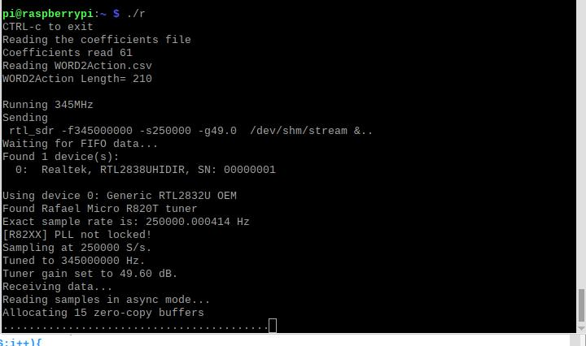

Well, as a friend of mine liked to say, "Now comes the hard part, we have to **think**".  You have to match the WORDs like FF7FD446EB00C30D to some device in your house and what event is that device reporting. I found it best to remove a device like a door sensor from its location and bring it, along with a magnet next to my terminal.  Then open a terminal window on the RPi and type "./r".

You should get a screen like:

The last row of "." should be growing about one per second.  They are the results of my printf each time I process a file from the stream.  In some cases, instead of a "." I printf a "^".  That is because the program took a longer then typical amount of time to process the file.  It used to happen often for me but I cleaned things up quite a bit and I no longer get the "^" unless running code::block in debug mode.  Other things you might see are:
* Unknown FF7FD446EB00C30D
* Unknown FF7FD446EB00C30D repeated 6 times
* Unknown FF7FB5E6D200BB09
* .....

Those are the result of two of your sensors reporting.  The first sent "FF7FD446EB00C30D" then repeated that 5 more times.  Then another sensor sent "FF7FB5E6D200BB09".  In the time between the first sensor and second sensor I was counting how many times the first WORD was sent.  When the second sensor reported I know the count for the first sensor so I report that count then the new sensor WORD.

Another thing that can show up is "Fn" where n ranges from 1 to 6.  It indicates that I got an invalid WORD and n is a code for why I decided it was invalid.  The "F" is my way of displaying that I am flushing the stream because something is wrong with the stream.  Typically it is a noise burst.  I don't know where they come from but they are of the same or similar magnitude as the good signals.  I don't remember what the 6 reasons are for flushing but they are things like the message was not 8 bytes long or violated the manchester coding or something else that I didn't know how to deal with.

