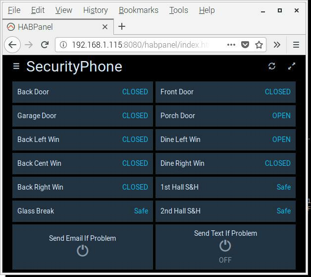

## To implement the system I used:
* Raspberry Pi 3 B+
* RTL-SDR Dongle
* AeoTec Dongle for Z-Wave devices
* The program 345MHz.
* The program rtl_sdr
* OpenHABian
* Code::Blocks
* The GUI that came with the RPi
* mosquitto

## Organization 
I created a folder, DCASS in /home/pi and all the files are there in folders and subfolders except for scripts "a", "b", and "r".
I put them in /home/pi so I can run them easily from PuTTY or Mobile SSH.
"r" runs 345MHz.  "a" and "b" display the logs 345MHzRamA.log or 345MHzRamB.log respectively.

## Organization - OpenHAB

The OpenHAB folders I used are in the **openhab2** folder.

Here is my current HABPanel screen.

